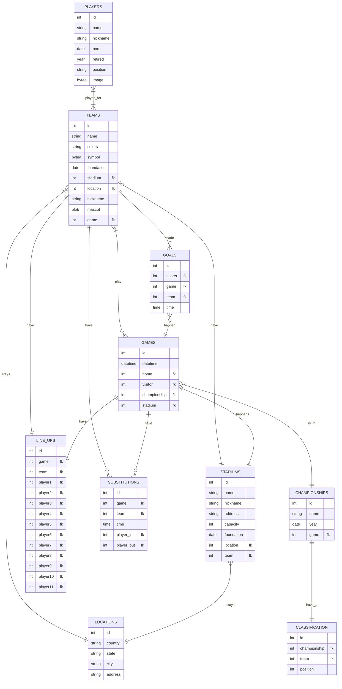

```mermaid

    erDiagram
        TEAMS }|--o{ GAMES : play
        TEAMS |o--|| STADIUMS : have
        TEAMS }|--|| LOCATIONS : stays
        STADIUMS }|--||LOCATIONS : stays
        GAMES ||--||STADIUMS : happens
        TEAMS ||--||LINE_UPS : have
        TEAMS ||--o{ SUBSTITUTIONS : have
        TEAMS ||--o{ GOALS : made
        GAMES }|--||CHAMPIONSHIPS : is_in
        CHAMPIONSHIPS ||--||CLASSIFICATION : have_a
        GOALS }o--||GAMES : happen
        GAMES ||--||LINE_UPS : have
        GAMES ||--o{ SUBSTITUTIONS : have
        PLAYERS }|--|{ TEAMS : played_for

        TEAMS {
            int id
            string name
            string colors
            bytea symbol
            date foundation
            int stadium fk
            int location fk
            string nickname
            blob mascot
            int game fk
        }

        STADIUMS {
            int id
            string name
            string nickname
            string address
            int capacity
            date foundation
            int location fk
            int team fk
        }

        LOCATIONS {
            int id
            string country
            string state
            string city
            string address
        }

        GAMES {
            int id
            datetime datetime
            int home fk
            int visitor fk
            int championship fk
            int stadium fk
        }

        LINE_UPS{
            int id
            int game fk
            int team fk
            int player1 fk
            int player2 fk
            int player3 fk
            int player4 fk
            int player5 fk
            int player6 fk
            int player7 fk
            int player8 fk
            int player9 fk
            int player10 fk
            int player11 fk
        }

        SUBSTITUTIONS {
            int id
            int game fk
            int team fk
            time time
            int player_in fk
            int player_out fk
        }

        GOALS {
            int id
            int scorer fk
            int game fk
            int team fk
            time time
        }

        CHAMPIONSHIPS {
            int id
            string name
            date year
            int game fk
        }

        CLASSIFICATION {
            int id
            int championship fk
            int team fk
            int position
        }

        PLAYERS {
            int id
            string name
            string nickname
            date born
            year retired
            string position
            bytea image
        }


```
