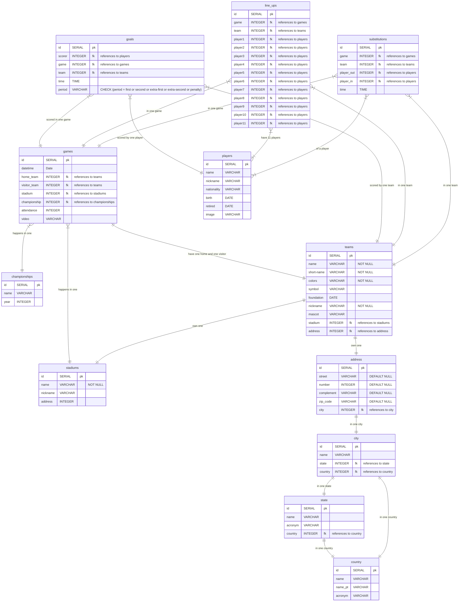

```mermaid
erDiagram

    games }|--|| championships : "happens in one"
    games ||--||teams : "have one home and one visitor"
    games }|--|| stadiums : "happens in one"
    games {
        id SERIAL pk
        datetime Date
        home_team INTEGER fk "references to teams"
        visitor_team INTEGER fk "references to teams"
        stadium INTEGER fk "references to stadiums"
        championship INTEGER fk "references to championships"
        attendance INTEGER
        video VARCHAR
    }

    teams ||--|| stadiums : "own one"
    teams ||--|| address : "own one"
    teams {
            id SERIAL pk
            name VARCHAR "NOT NULL"
            short-name VARCHAR "NOT NULL"
            colors VARCHAR "NOT NULL"
            symbol VARCHAR
            foundation DATE
            nickname VARCHAR "NOT NULL"
            mascot VARCHAR
            stadium INTEGER fk "references to stadiums"
            address INTEGER fk "references to address"
    }

    stadiums {
            id SERIAL pk
            name VARCHAR "NOT NULL"
            nickname VARCHAR
            address INTEGER
        }

    address ||--|| city : "in one city"
    address {
            id SERIAL pk
            street VARCHAR "DEFAULT NULL"
            number INTEGER "DEFAULT NULL"
            complement VARCHAR "DEFAULT NULL"
            zip_code VARCHAR "DEFAULT NULL"
            city INTEGER fk "references to city"
        }


    country {
        id SERIAL pk
        name VARCHAR
        name_pt VARCHAR
        acronym VARCHAR
    }

    state ||--|| country : "in one country"
    state {
        id SERIAL pk
        name VARCHAR
        acronym VARCHAR
        country INTEGER fk "references to country"
    }

    city ||--|| country : "in one country"
    city ||--|| state : "in one state"
    city {
        id SERIAL pk
        name VARCHAR
        state INTEGER fk "references to state"
        country INTEGER fk "references to country"
    }

    goals }|--|| players : "scored by one player"
    goals }|--|| teams : "scored by one team"
    goals }|--|| games : "scored in one game"
    goals {
        id SERIAL pk
        scorer INTEGER fk "references to players"
        game INTEGER fk "references to	games"
        team INTEGER fk "references to	teams"
        time TIME
        period VARCHAR "CHECK (period = first or second or extra-first or extra-second or penalty)"
    }

    players {
        id SERIAL pk
        name VARCHAR
        nickname VARCHAR
        nationality VARCHAR
        birth DATE
        retired DATE
        image VARCHAR
        }

    line_ups }|--|{ players : "have 11 players"
    line_ups }|--|| teams : "in one team"
    line_ups }|--|| games : "in one game"
    line_ups {
        id SERIAL pk
        game INTEGER fk "references to games"
        team INTEGER fk "references to teams"
        player1 INTEGER fk "references to players"
        player2 INTEGER fk "references to players"
        player3 INTEGER fk "references to players"
        player4 INTEGER fk "references to players"
        player5 INTEGER fk "references to players"
        player6 INTEGER fk "references to players"
        player7 INTEGER fk "references to players"
        player8 INTEGER fk "references to players"
        player9 INTEGER fk "references to players"
        player10 INTEGER fk "references to players"
        player11 INTEGER fk "references to players"
    }

    substitutions }|--|{ players : "of a player"
    substitutions }|--|| teams : "in one team"
    substitutions }|--|| games : "in one game"
    substitutions {
        id SERIAL pk
        game INTEGER fk "references to games"
        team INTEGER fk "references to teams"
        player_out INTEGER fk "references to players"
        player_in INTEGER fk "references to players"
        time TIME
    }

    championships {
        id SERIAL pk
        name VARCHAR
        year INTEGER

    }

```
