Football may have very remote origins in practices that existed in Asia, among the Mayans, or in festive events in Florence. However, it was in England that this sport took on the contours that made it practiced in almost every country in the world.
The penetration of this sport in the culture was so deep-rooted that it shaped several aspects of the different societies where it was established.
Thus, the imagination and memory refer to the unmarked fields with crooked goalposts and also to the great stadiums where the best players in the world founded their legends.
However, imagination often surpasses memory, and that mythical game is lost in the mists of history. That is why this project is called...

# FOOTBALL DATABASE

By Wilson de Souza Pereira

Video overview: https://youtu.be/6jDh1uq1h98

This database was created in PostgreSQL as footballdb.
The games table is the heart of the database and in it we have the following:

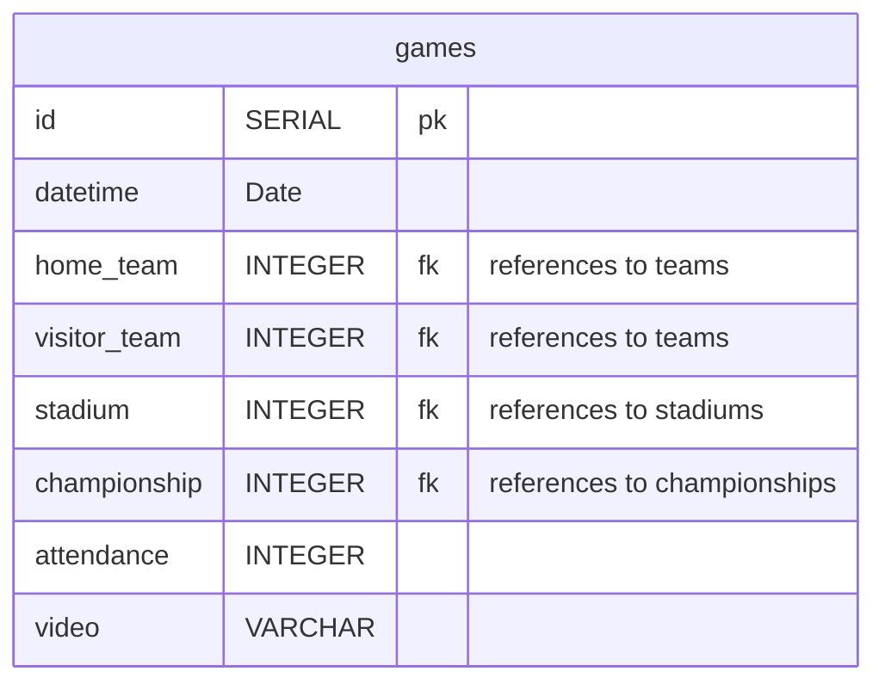

The table is mainly composed of foreign keys. Only the date of the game, the audience present and a video URL are data to be inserted in this table.
The information on the contenders, the stadium and the championship to which the game is linked will be part of other tables.
The main one is the teams table:

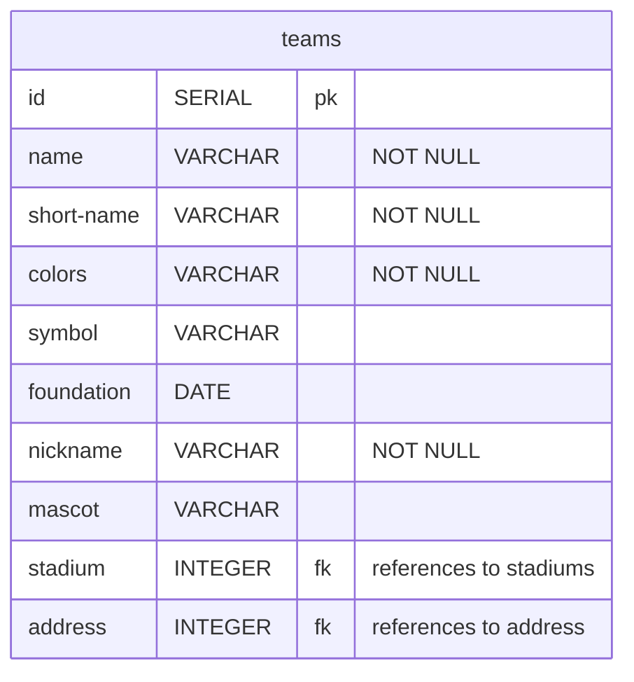

Each team will be represented by its official name, the name by which it is known (short_name), its colors, the shield, the mascot and its nickname. It will be possible to register the stadium if the team has its own stadium. The year of foundation and its address complete the details of the teams, whether they are the home or away teams in a match.
The stadiums will be recorded in a specific table:

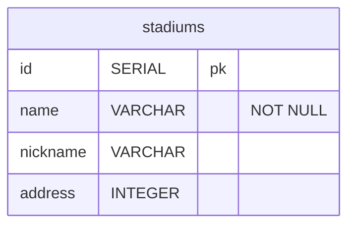

In it we will have the official name and nickname of the stadium.
In the same way as the "teams" table, this table is also linked to the "address" table:

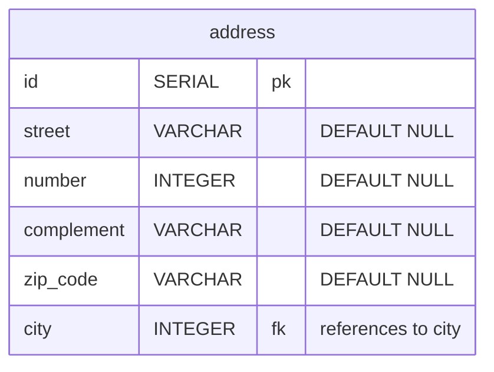

The street, number and zip code will be recorded here. The country, state/province/region and city will have their own tables.

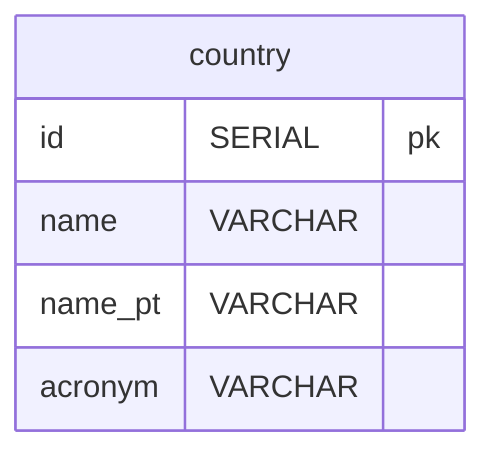

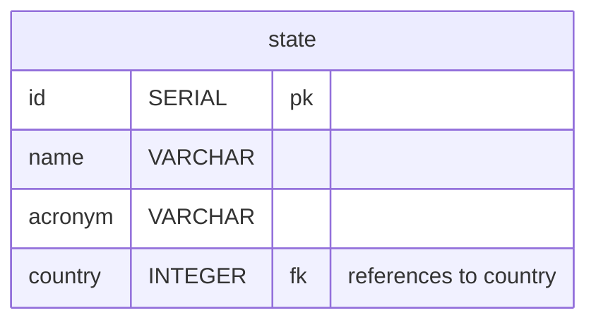

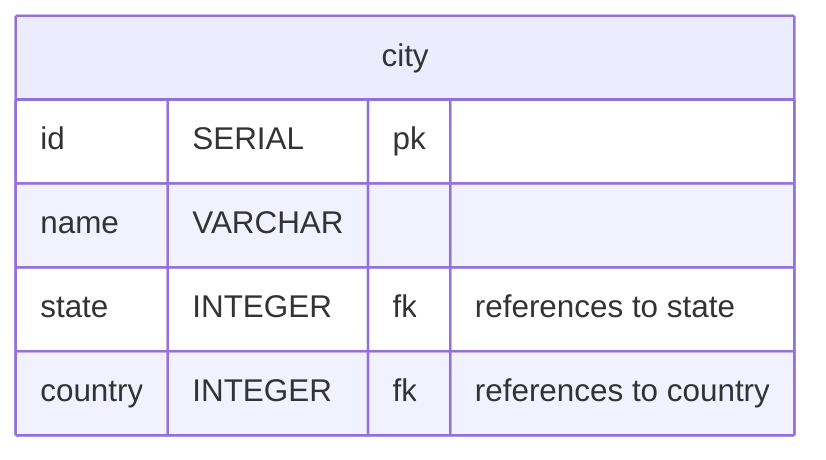

But games are remembered for the goals scored when everything seemed lost. Those moments that made that moment a memory forever. The goals table has this configuration:

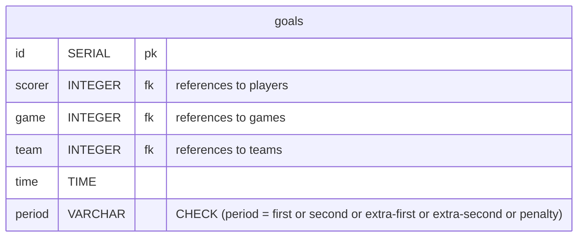

This table will indicate the moment in which each goal occurred, for this purpose the time will be recorded, from 0 to 45 minutes, plus the injury time and the period in which it occurred, accepting first and second for normal time and extra-first and extra-second for overtime. And also the penalty shootouts.
The player, his team, and the game in which the goal occurred will be provided by other tables.
The teams and games tables have already been seen. The table of who pushed the ball into the net is missing. Whoever scored the goal will be in the players table:

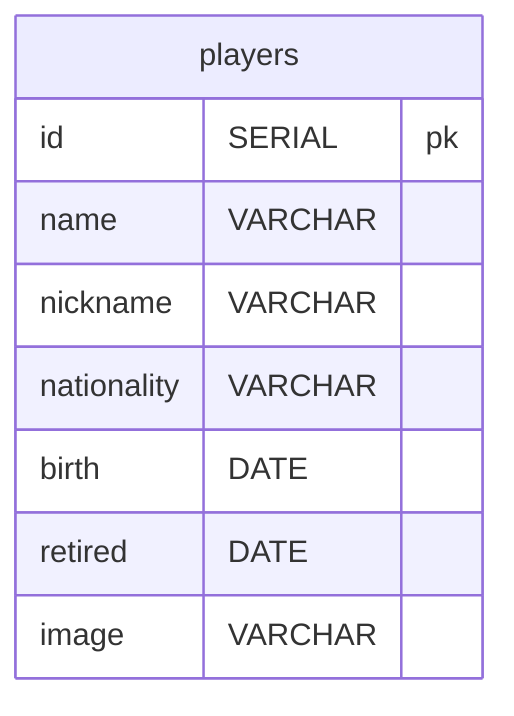

The details in this table will provide the player's full **name**, the **nickname** by which he was known, his **nationality**, when he was born (**birth**) and when he **retired** from the field. For completeness a photo (**image**) can be provided from a URL.
Bem, quem faz gol não faz sozinho. Por isso a tabela players serve também para formar a esclação de um time.

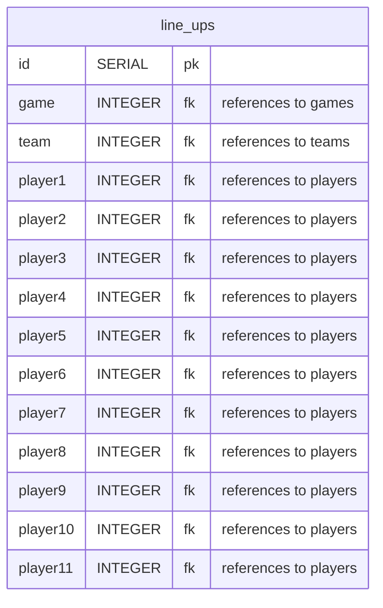

This table will tell you which group of players formed the lineup in each game for each team.
Substitutions will be in a separate table.

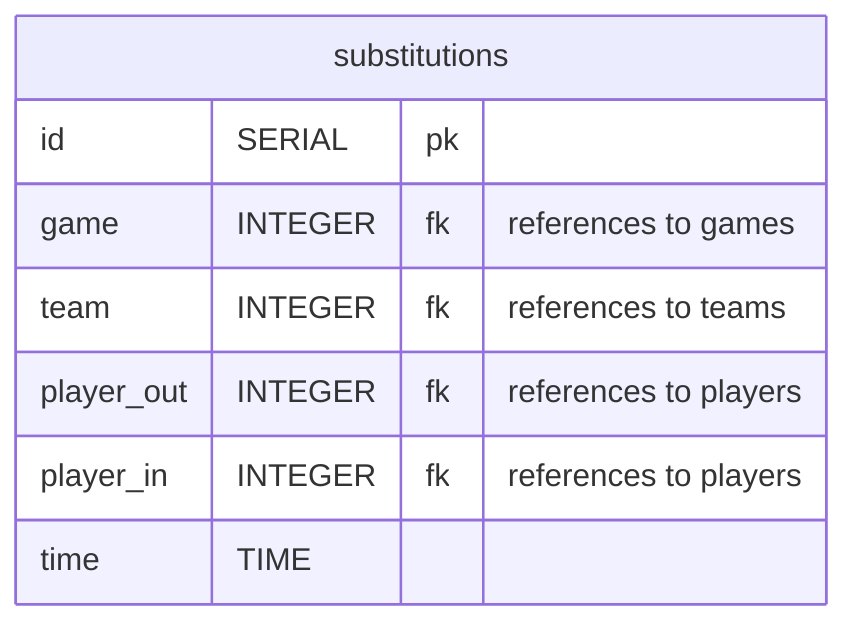

Finally, games take place within or outside of championships. It could be a game against a team from the neighboring district or the World Cup final. The championships table is linked to the games:

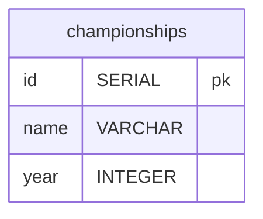

Championships are developed in formulas that can be just one game, like the old intercontinental disputes between the European and South American champions, or they can be very complex with several phases and classification between phases in turns.
That is why the development of tables that cover all these possibilities is still a work in progress. But it is expected that it will be possible to record and obtain information on the entire development of a championship.
Any championship and even games between neighboring teams.

Legendary games are worth remembering. The game_goals view allows you, among other things, to get the score of a match or to know who scored each goal.

CREATE VIEW "game_goals" AS
SELECT
players.nickname AS player_nickname,  
 t_id.short_name AS team_short_name,
time,
period,
t_id.id AS team_id,
t_h.short_name AS home,
t_v.short_name AS visitor,
championships.name AS championship,
championships.year AS year,
datetime AS date
FROM games
JOIN goals ON games.id = goals.game
JOIN championships ON championships.id = games.championship
JOIN players ON scorer = players.id
JOIN teams t_id ON t_id.id = goals.team
JOIN teams t_h ON home_team = t_h.id
JOIN teams t_v ON visitor_team = t_v.id

It is possible to know who booked and at what time with a query like this:

SELECT player_nickname, team_short_name, time, period FROM game_goals
WHERE home = 'Coritiba'
AND visitor = 'Santos'
AND championship = 'Campeonato Brasileiro'
AND year = 1985  
 ORDER BY period;

In this case the result will be this:

| player_nickname | team_short_name |   time   | period |
| :-------------- | :-------------: | :------: | -----: |
| Vavá            |    Coritiba     | 00:25:00 |  first |
| Márcio Rossini  |     Santos      | 00:29:00 |  first |
| Lela            |    Coritiba     | 00:45:00 | second |

But if you just want to know the final score:

SELECT team_short_name, COUNT(team_short_name) FROM game_goals
WHERE home = 'Coritiba'
AND visitor = 'Santos'
AND championship = 'Campeonato Brasileiro'
AND year = 1985  
 GROUP BY team_short_name

| team_short_name | count |
| :-------------- | :---: |
| Coritiba        |   2   |
| Santos          |   1   |

To find out which players were in a certain match you can use the game_line_up view.

CREATE VIEW game_line_up AS
SELECT
p1.nickname AS player1,
p2.nickname AS player2,
p3.nickname AS player3,
p4.nickname AS player4,
p5.nickname AS player5,
p6.nickname AS player6,
p7.nickname AS player7,
p8.nickname AS player8,
p9.nickname AS player9,
p10.nickname AS player10,
p11.nickname AS player11,
t_id.short_name AS team,
t_h.short_name AS home,
t_v.short_name AS visitor,
championships.name AS championship,
championships.year AS year,
games.datetime AS date
FROM line_ups lu
JOIN players p1 ON lu.player1 = p1.id
JOIN players p2 ON lu.player2 = p2.id
JOIN players p3 ON lu.player3 = p3.id
JOIN players p4 ON lu.player4 = p4.id
JOIN players p5 ON lu.player5 = p5.id
JOIN players p6 ON lu.player6 = p6.id
JOIN players p7 ON lu.player7 = p7.id
JOIN players p8 ON lu.player8 = p8.id
JOIN players p9 ON lu.player9 = p9.id
JOIN players p10 ON lu.player10 = p10.id
JOIN players p11 ON lu.player11 = p11.id
JOIN teams t_id ON team = t_id.id
JOIN games ON lu.game = games.id
JOIN teams t_h ON home_team = t_h.id
JOIN teams t_v ON visitor_team = t_v.id
JOIN championships ON games.championship = championships.id

In it, the players table is joined to the games, teams and championships tables so that it is possible to check whether a player played a certain match, like this:

SELECT team, player11
FROM game_line_up
WHERE visitor = 'Santos'
AND championship = 'Campeonato Brasileiro'
AND year = 1985

The result is this:

| team     | player11  |
| :------- | :-------: |
| Coritiba |   Édson   |
| Santos   | Zé Sérgio |

The teams_details view was also created to obtain all the information for each team.

CREATE VIEW "teams_details" AS
SELECT
teams.name AS team,
teams.short_name,
colors,
foundation,
mascot,
symbol,
teams.nickname,
stadiums.name AS stadium,
city.name AS city,
state.name AS state,
country.name AS country,
street,
number,
zip_code
FROM teams
JOIN address ON address = address.id
JOIN city ON address.city = city.id
JOIN state ON city.state = state.id
JOIN country ON city.country = country.id
JOIN stadiums ON stadium = stadiums.id

For example, you can make this query:
SELECT
team,
short_name,
colors,
foundation,
mascot,
nickname,
stadium,
city,
state,
country,
street,
number,
zip_code
FROM teams_details
WHERE short_name = 'Santos'
And this is the result:

| team                 | short_name |     colors      | foundation | mascot | nickname |     stadium     |  city  |   state   | country |       street        | number | zip_code |
| :------------------- | :--------: | :-------------: | :--------: | :----: | :------: | :-------------: | :----: | :-------: | :-----: | :-----------------: | :----: | -------: |
| Santos Futebol Clube |   Santos   | Black and White | 1912-04-14 | Baleia |  Peixe   | Urbano Caldeira | Santos | São Paulo | Brazil  | Rua Princesa Isabel |  NULL  | 11075500 |

### Conclusion

This is a work in progress. Many improvements and additions can and will be made. It is hoped that in the end it will be possible not only to consult the past of football, but also to follow championships in development. But that is another story.

### Entity Relationship Diagram

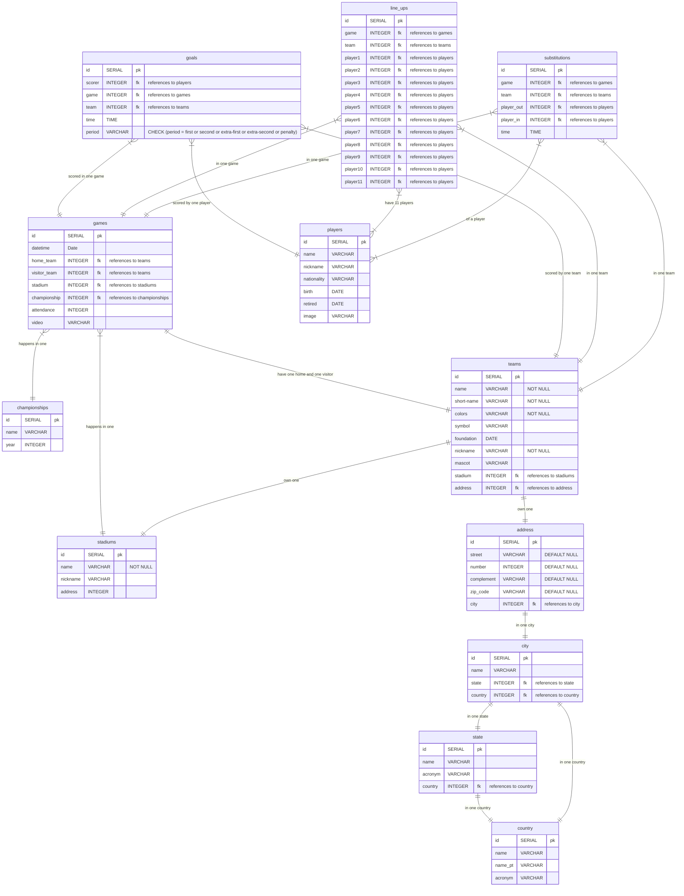
